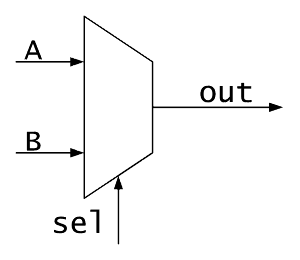

**Verilog**

Verilog is language commonly used in designing digital systems. It is a hardware description language, which means that it is substantially different from any other language you might have encountered so far. Even though it does have control flow statements and variables, it relies primarily on logic functions. It is a textual format for describing electronic circuits and systems.  

Verilog has evolved as a standard hardware description language. Verilog offers many useful features for hardware design. It is easy to learn and easy to use as it is similar to C Programming language. Designers with C Programming experience will find it easy to learn Verilog.  

**Multiplexer**
This module explains how to build a 2 X 1 Multiplexer using Verilog. In electronics, a multiplexer or mux is a device that selects one of several analog or digital input signals and forwards the selected input into a single line. Multiplexers were logically designed and used as electronic selector switches. A multiplexer of 2n inputs has n select lines, which are used to select which input line to send to the output. Multiplexers are mainly used to increase the amount of data that can be sent over the network within a certain amount of time and bandwidth. On the other hand, a demultiplexer (or demux) is a device taking a single input signal and selecting one of many data-output-lines, which is connected to the single input. A multiplexer is often used with a complementary demultiplexer on the receiving end.

